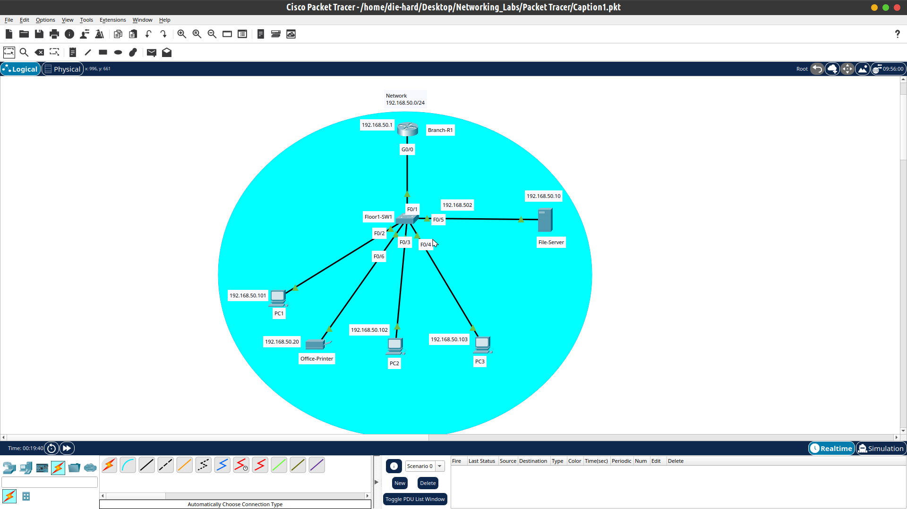

# Small Office Networking Deployment & Troubleshooting

## Project Overview

This project demonstrates the deployment and troubleshooting of a small office network using a star topology. The network consists of one router, one switch, one server, one printer, and three PCs, with the switch serving as the central connection point for all devices.

Static IP addressing was configured for the network devices, and an FTP server was configured and tested successfully. Network connectivity between the devices was verified, and additional troubleshooting and verification were performed by checking the MAC address table and interface status on the switch.

As part of the troubleshooting process, three simulated network support tickets were created to identify and resolve configuration issues. The troubleshooting scenarios included an incorrect network/subnet mask, an incorrect default gateway, and an administratively shut-down interface. Each issue was investigated, corrected, and tested to verify that network connectivity was restored.

## Skills Demonstrated

- Small office network design using a star topology
- Static IPv4 addressing
- Router and switch configuration
- FTP server configuration and testing
- Network connectivity testing using ping
- MAC address table verification
- Switch interface status verification
- Troubleshooting incorrect subnet masks
- Troubleshooting incorrect default gateways
- Troubleshooting administratively shut-down interfaces

## Technologies & Tools

- Cisco Packet Tracer
- IPv4
- Ethernet / LAN
- Cisco IOS
- FTP
- Basic network troubleshooting

## Troubleshooting Summary

Three simulated network support tickets were created and resolved:

- **Incorrect subnet mask** — Corrected the host's network configuration and verified connectivity.
- **Incorrect default gateway** — Corrected the gateway configuration and verified connectivity.
- **Administratively shut-down interface** — Identified the Layer 1 connectivity issue and restored the interface to an operational state.

Detailed troubleshooting steps and supporting screenshots are available in the project documentation.

## Network Topology

## Project Structure

- [`Caption1.pkt`](./Caption1.pkt) — Cisco Packet Tracer project file containing the network topology and configurations.
- [`Lab_Documentations--Networking--Basic.pdf`](./Lab_Documentations--Networking--Basic.pdf) — Detailed project documentation covering the network deployment, configuration, testing, and troubleshooting.
- [`Screenshots/`](./Screenshots/) — Screenshots showing the network topology, connectivity testing, FTP testing, MAC address table, and interface status.
